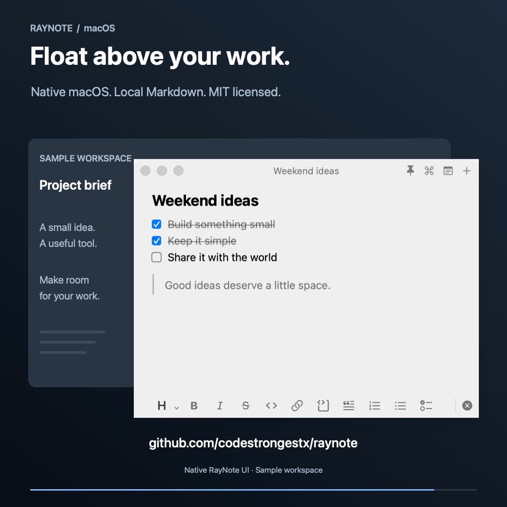
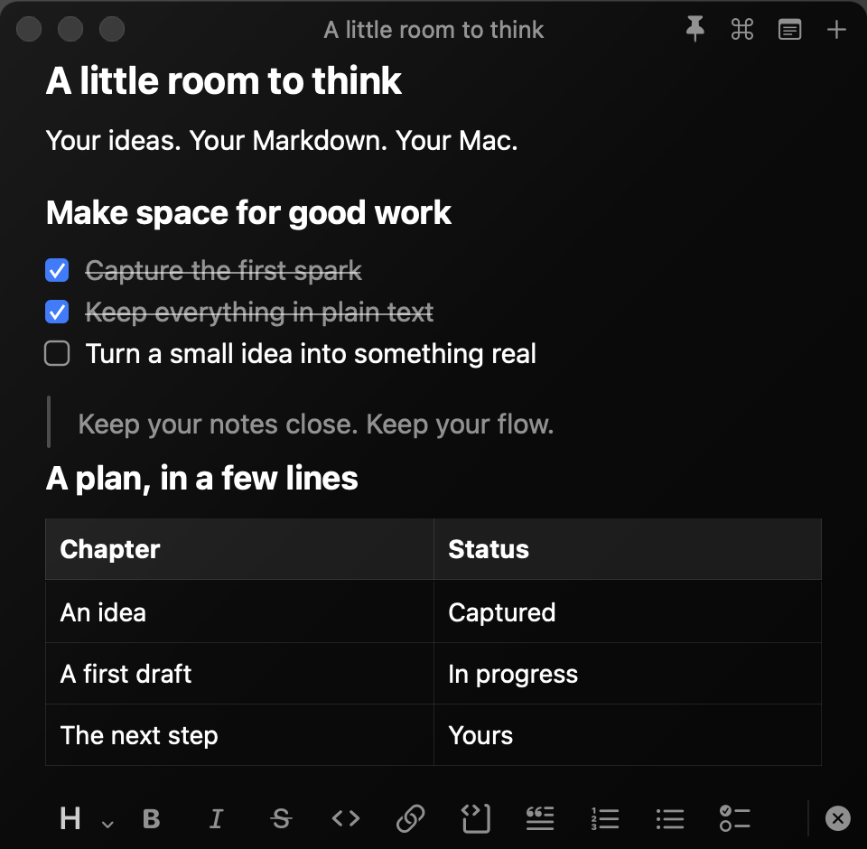
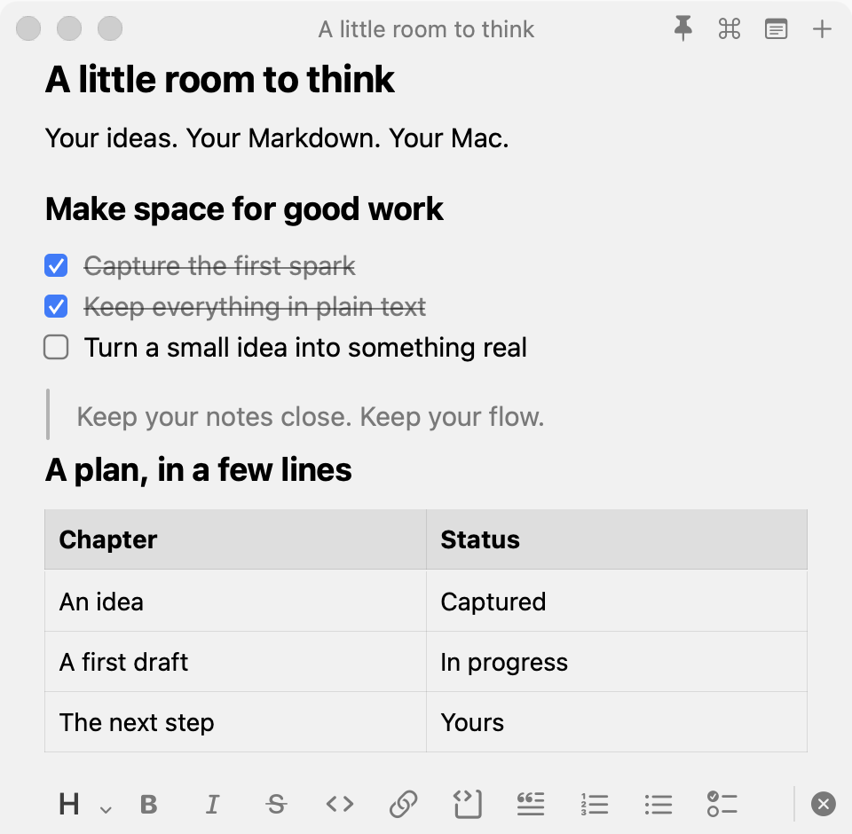

<div align="center">

# RayNote

**A floating Markdown notepad for macOS.**

Always on top when pinned · Instant shortcut access · Plain local Markdown files

[Get started](#get-started) · [Shortcuts](docs/shortcuts.md) · [Contributing](CONTRIBUTING.md) · [MIT license](LICENSE)

</div>

<p align="center">
  
</p>

<p align="center">
  
  
</p>

<p align="center"><sub>Native app views with sample notes. The floating preview is composed over an illustrative workspace.</sub></p>

RayNote floats above your other windows so you can keep notes in sight while you work. Click the pin to keep it on top, or unpin it to use it like a regular window. Summon or hide it with `⌃⌥N` or the menu-bar icon, and capture ideas without losing your place. Your notes stay in ordinary Markdown files on your Mac.

## Made for your workflow

- **Float above your work.** Keep a checklist, reference, or scratchpad visible over other apps with the pin control.
- **One click away.** Open and hide notes from the menu bar. Right-click for actions, or use a shortcut of your choice.
- **Markdown that feels native.** Headings, emphasis, lists, checkboxes, code, quotes, tables, and local images—with native selection, find/replace, and undo.
- **A window that stays put.** Resize it once. Switching notes keeps the same window size and restores each note's selection and scroll position.
- **Your files, your notes.** No account, subscription, or app-imposed storage quota. Disk space and memory are the practical limits.
- **Images included.** Paste images into a note; import and export Markdown with portable local attachments.
- **Light, dark, or automatic.** Choose an appearance in Settings.

## Get started

**macOS 14+ · Swift 6+ to build · No external Swift package dependencies**

Install Xcode or Command Line Tools with Swift 6 or later, then:

```sh
git clone https://github.com/codestrongestx/raynote.git
cd raynote
./scripts/build-app.sh
open dist/RayNote.app
```

To install, quit RayNote and copy **`dist/RayNote.app`** into **Applications**. The built app runs without the source folder or developer tools.

> **Early preview:** builds are locally ad-hoc signed. A Developer ID signed and notarized download is not available yet.

## A few useful controls

| Action | Control |
| --- | --- |
| Show or hide notes | Click the menu-bar icon, or `⌃⌥N` |
| Create a note | `⌘N` |
| Search your notes | `⌘P` |
| Find in the current note | `⌘F` |
| Bold / italic / inline code | `⌘B` / `⌘I` / `⌘E` |
| Keep the window on top | Click the pin |
| Change the theme | Settings → Appearance |

[All shortcuts →](docs/shortcuts.md)

Markdown syntax appears on the line you are editing and is hidden elsewhere. Click a table row or local image to edit its source. For raw Markdown, use **View → Toggle Markdown Source**; **Reading View** offers a separate reading layout.

## Local by design

Your notes live in `~/Library/Application Support/RayNote/Notes`. The library includes local attachments, recoverable deleted notes, and recovery drafts when a save fails. Updating the app does not move your notes.

Back up the full RayNote data directory. There is no cloud sync or application-level encryption. Remote images in reading view make requests to their image hosts.

[Storage details and Markdown limitations →](docs/storage-and-markdown.md)

## Development

```sh
swift test
./scripts/build-qa-app.sh
open .build/RayNoteQA.app
```

The QA app uses a separate library and preferences. To regenerate the README's native UI images:

```sh
./scripts/render-readme-images.sh
```

See [CONTRIBUTING.md](CONTRIBUTING.md) for checks and contribution guidance.

## License

[MIT](LICENSE) © 2026 codestrongestx.

Inspired by Raycast Notes. Independently developed and not affiliated with Raycast.
